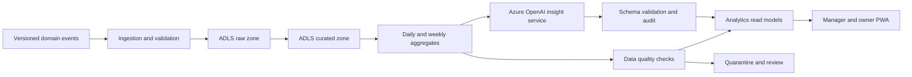

# Analytics Platform

## Purpose

Shows the governed path from versioned business events to operational aggregates, read models, and asynchronous AI insights.

AI is advisory and asynchronous. It cannot approve payments, set prices, mutate inventory, or block checkout. Ownership: Analytics. Status: Proposed.
