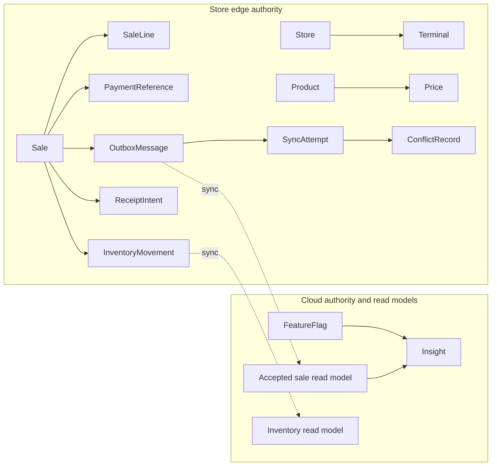

# Data Ownership

## Purpose

Identifies core domain records and their authoritative boundary. Cloud acceptance and reporting do not remove the edge ownership needed for local checkout state and recovery.

Notes: Store and Terminal are edge configuration roots. Sale and its local effects are transaction-owned by the edge. Feature flags are cloud-managed with an authenticated edge snapshot. Insight is cloud-owned and advisory. Ownership: Domain and data. Status: Proposed.
