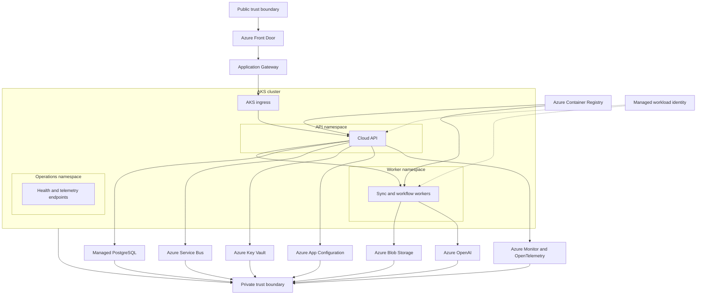

# Deployment Topology

## Purpose

Shows the proposed public and private boundaries for cloud workloads and managed dependencies. Exact SKUs, regions, node pools, and network ranges are decision required.

Ownership: Platform. Status: Proposed.
