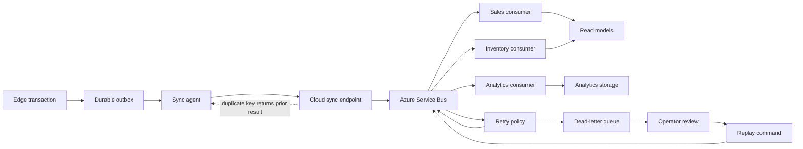

# Event Topology

## Purpose

Shows how an edge transaction becomes a durable event, is synchronized idempotently, and is processed with retry, dead-letter, and replay paths.

Events require stable IDs, aggregate IDs, store IDs, occurred time, schema version, and idempotency behavior. Ownership: Edge and cloud. Status: Proposed.
