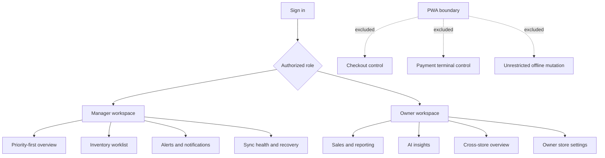

# PWA Navigation

## Purpose

Defines the manager and owner PWA navigation boundary. Checkout, terminal control, and payment authorization are explicitly excluded.

Offline PWA behavior is limited to a small read cache and explicitly supported queued commands with pending status. The modern view plan is documented in `docs/features/FEAT-009-manager-owner-pwa/modern-view-plan.md`. Ownership: Web and identity. Status: Planned.
