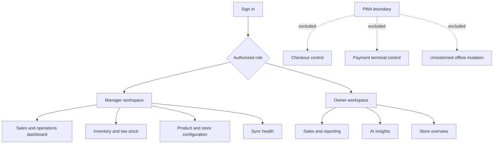

# PWA Navigation

## Purpose

Defines the manager and owner PWA navigation boundary. Checkout, terminal control, and payment authorization are explicitly excluded.

Offline PWA behavior is limited to a small read cache and explicitly supported queued commands with pending status. Ownership: Web and identity. Status: Proposed.
