# Release Flow

## Purpose

Shows proposed promotion controls for immutable images, environment approvals, health checks, feature activation, and rollback.

```mermaid
flowchart LR
    PR[Pull request] --> TESTS[Tests and security scans]
    TESTS --> IMAGE[Versioned container image]
    IMAGE --> ACR[Azure Container Registry]
    ACR --> DEV[AKS development]
    DEV --> STAGE[AKS staging]
    STAGE --> APPROVAL[Release approval]
    APPROVAL --> PILOT[AKS pilot environment]
    PILOT --> HEALTH[Health checks and telemetry]
    HEALTH --> FLAG[Feature flag activation]
    FLAG --> PROD[AKS production]
    HEALTH -. failed .-> ROLLBACK[Rollback image or disable flag]
    PROD -. incident .-> ROLLBACK
    ROLLBACK --> HEALTH
```

Schema changes must support the old and new flag states during rollout. Production approvers, environment names, and deployment tooling are TBD. Ownership: Delivery. Status: Proposed.
