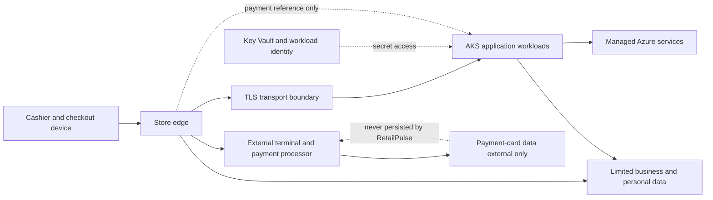

# Security Boundaries

## Purpose

Shows trust zones and data classification. Payment-card data is captured and handled outside RetailPulse; only approved references cross the adapter boundary.

Controls include device and user authentication, authorization at each API, encryption in transit and at rest, secret isolation, structured audit records, and data minimization. Exact retention and regulatory obligations are decision required. Ownership: Security. Status: Proposed.
