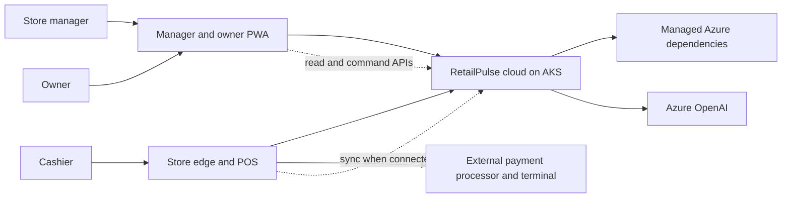

# System Context

## Purpose

Shows the primary users, the store edge transaction boundary, cloud coordination, Azure dependencies, external payment, and the manager/owner PWA.

Ownership: Architecture. Status: Proposed.
