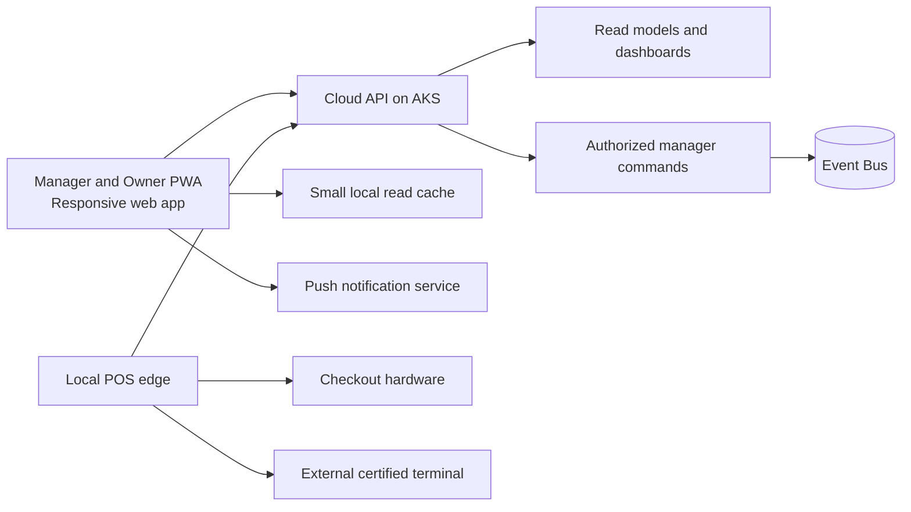
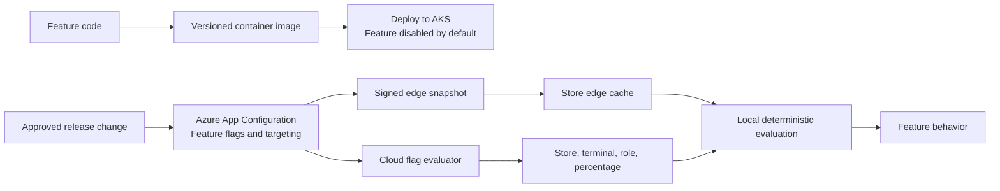
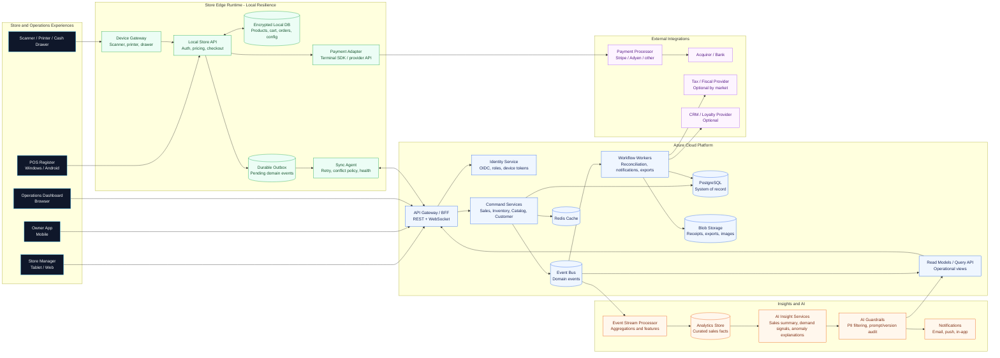
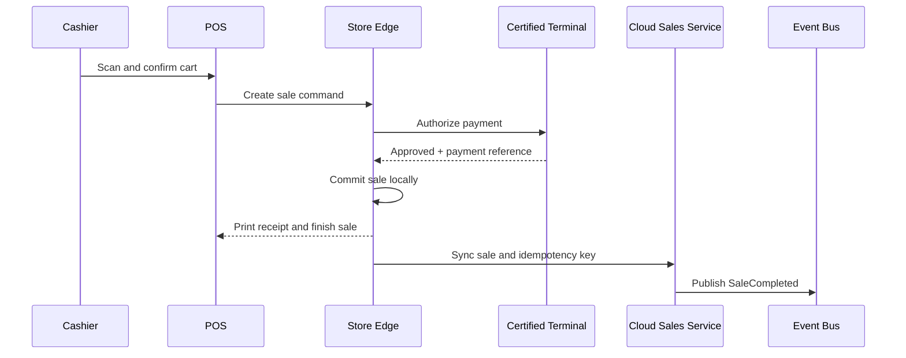
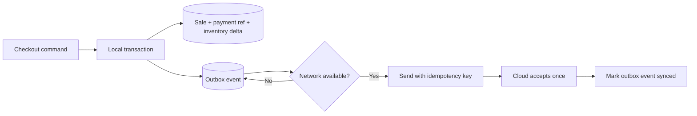
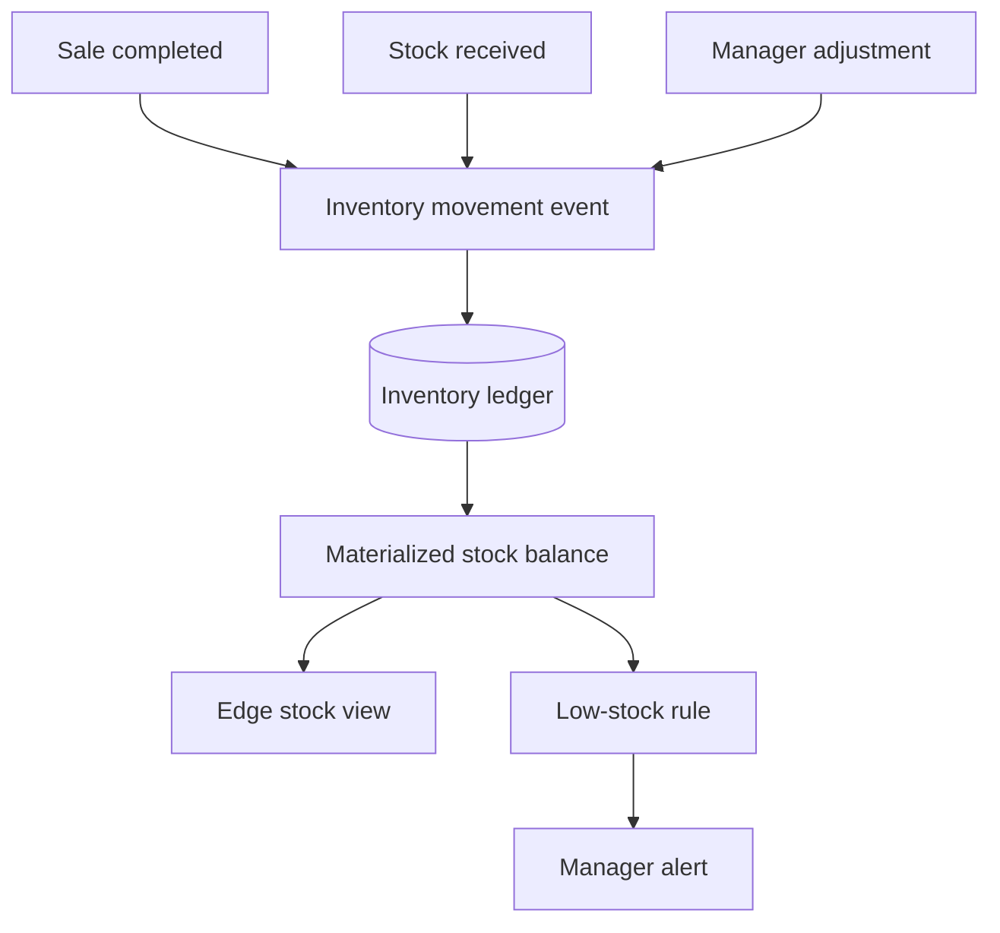
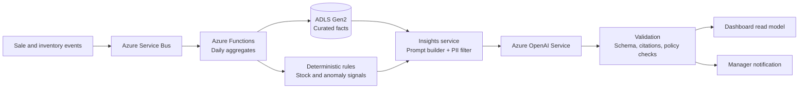

# RetailPulse POS: Modern MVP Architecture

## Architecture direction

The current diagram is a good capability map, but it presents the POS as a cloud-hosted application with an offline add-on. This design reverses that priority:

- **Store edge owns local checkout state and recovery** when the cloud is unavailable; payment authorization remains provider-dependent.
- **Cloud is the coordination and intelligence layer**, while the POS remains responsive during temporary cloud failures.
- **Events connect business capabilities** so checkout, inventory, loyalty, reporting, and AI can evolve independently.
- **Payments remain isolated** behind a provider adapter and certified terminal boundary.
- **AI consumes governed business events** and never sits in the checkout critical path.

## Multi-tenant and store isolation

RetailPulse is designed for multiple retail tenants and multiple stores per tenant. Tenant isolation is a cross-cutting security invariant, not a UI feature.

- Every authenticated request resolves a trusted `tenantId`, permitted `storeIds`, subject, role, and device scope server-side.
- Client-supplied tenant or store filters are treated as requested scope and are intersected with trusted permissions; they never grant access.
- Every tenant-owned database row, command, event, outbox message, cache key, analytics partition, export, and audit record carries tenant scope. Store-scoped records also carry `storeId`.
- Cloud queries must apply tenant and store predicates before returning or aggregating data. Cross-tenant joins and exports are denied by default.
- Service Bus consumers, workers, feature flags, and AI insight jobs revalidate scope instead of trusting only the producer.
- Edge devices are registered to exactly one tenant and store. A device cannot impersonate a user or another store.
- Logs and telemetry use tenant/store dimensions only for authorized operational views and must not expose unnecessary personal data.

The system should prefer database-level protections such as PostgreSQL row-level security or an equivalent repository policy in addition to application authorization. Isolation tests must include cross-tenant reads, writes, events, cache lookups, exports, replay, and analytics queries.

## Mobile experience strategy

Mobile is useful for owners and store managers, but a phone should not become the primary checkout device in the MVP. Build the manager and owner experience as a responsive **Progressive Web App (PWA)** backed by the same cloud APIs as the web dashboard.

The PWA should support:

- Sales, inventory, low-stock, and sync-health dashboards.
- Product and store configuration workflows that do not require specialized hardware.
- AI summaries and anomaly explanations.
- Push notifications for low stock, sync failures, and approved operational alerts.
- Installable behavior, responsive layouts, secure authentication, and a small read-only offline cache.

The PWA should not own authoritative checkout state, payment-terminal control, or unrestricted offline mutations. Those responsibilities stay with the local edge runtime. If managers need to make adjustments while offline, queue only explicitly supported commands and show their pending status until the edge or cloud confirms them.

Use a PWA first because it gives one deployable experience across desktop, tablet, Android, and iOS, with no app-store release cycle. A native mobile app becomes justified later for background location, advanced push behavior, camera-heavy workflows, Bluetooth peripherals, or app-store distribution requirements.



## Feature flag and controlled release design

Feature flags are part of the platform design. A deployment makes code available; a feature flag decides who can use it. This allows RetailPulse to release safely by environment, store, terminal, role, or percentage without rebuilding or redeploying the application.

Use a small feature-flag abstraction in application code, with server-side evaluation for cloud APIs and a locally cached snapshot for the store edge. The MVP can use Azure App Configuration Feature Management. The abstraction should remain compatible with OpenFeature so a later move to Unleash or another open-source provider does not change business code.

Required flag properties:

- Stable key, description, owner, expiry date, and risk classification.
- Default value that is safe when the flag service is unavailable.
- Targeting rules for environment, store, terminal, role, and percentage rollout.
- Audit history for creation, changes, actor, reason, and approval.
- Separate permissions for viewing, changing, and approving production flags.
- A cleanup issue or expiry date so temporary flags do not become permanent branches.

The edge runtime must receive a signed or authenticated flag snapshot and cache it locally. Checkout-critical flags must have a deterministic local fallback. A cloud flag outage must not stop sales. Flag evaluation must never be used to bypass authorization or payment-provider rules.



Recommended rollout sequence:

1. Merge and build the feature with its flag defaulted off.
2. Deploy the immutable image to AKS and run automated tests.
3. Enable the flag in development and staging.
4. Enable it for internal users or one pilot store.
5. Monitor errors, latency, sync health, and business metrics.
6. Expand the rollout gradually, with a tested rollback that disables the flag.
7. Remove the flag and dead code after the rollout is complete.

## Payment boundary and scope

RetailPulse is **not** a payment processor, card network, acquirer, or banking system. Payment processing is out of scope for the MVP.

The POS integrates with an existing certified payment terminal and its selected payment service provider. The integration is limited to:

- Sending an amount and transaction request to the terminal or PSP adapter.
- Receiving approved, declined, cancelled, or pending status.
- Storing a processor transaction reference and reconciliation status.
- Supporting refunds through the PSP's supported API or terminal workflow.

The POS must never store PAN, CVV, PIN, magnetic-stripe data, or raw card information. The payment provider and certified terminal remain responsible for card capture, tokenization, authorization, settlement, PCI scope, and the relationship with the acquiring bank.

In the diagram, **Payment Adapter**, **Payment Processor**, and **Acquirer / Bank** are external integration boundaries. They are dependencies, not RetailPulse-owned services.

## What is implemented today

This repository currently contains the architecture specification only. AI is included in the design as a planned, asynchronous capability; no POS, cloud service, data pipeline, or model integration has been implemented yet.

The first AI release should be deliberately narrow:

- **Sales summary:** generate a manager-friendly summary from daily or weekly aggregates.
- **Low-stock explanation:** explain which products are likely to run out and cite the supporting sales and stock values.
- **Anomaly detection:** flag unusual refunds, sales drops, or product spikes using deterministic thresholds first, with an LLM used only to explain the result.

AI should not approve payments, set prices, mutate inventory, or block checkout in the MVP.

## Proposed system diagram



## Critical flows

### 1. Sale while online



### 2. Sale while offline

The checkout path is identical up to local commit. The edge runtime records the payment reference, sale, inventory reservation, and receipt intent in one local transaction. The durable outbox retries synchronization later. Every cloud command is idempotent, so retries cannot create duplicate sales.



### 3. Inventory consistency

Inventory is represented as an append-only movement ledger rather than only a mutable stock number. The edge can calculate an available quantity locally; the cloud reconciles movements by store and SKU. Conflicts are explicit, reviewable, and never silently overwrite a sale.



## Why this is different from a conventional POS

| Conventional POS pattern | RetailPulse direction |
|---|---|
| Cloud request is required for checkout | Local edge commits the sale first |
| Large central application owns every workflow | Domain services publish events and workers handle side effects |
| Stock is a mutable field | Inventory movement ledger plus materialized balances |
| AI is placed beside operational services | AI is downstream of governed analytics data |
| Payment integration leaks into checkout code | Certified payment adapter isolates provider changes |
| Offline mode is a fallback screen | Offline mode is the normal edge runtime with sync health |
| Reporting queries production transaction tables | Read models and analytics store protect checkout performance |

## MVP service boundaries

| Boundary | Owns | Emits |
|---|---|---|
| Edge Runtime | Local checkout, device access, encrypted local data, outbox | `SaleCommitted`, `PaymentCaptured`, `InventoryMoved` |
| Sales | Sale lifecycle, returns, receipts, idempotency | `SaleCompleted`, `SaleRefunded` |
| Inventory | Movement ledger, reservations, stock balance | `StockLow`, `StockAdjusted` |
| Catalog | Products, prices, tax categories | `ProductChanged`, `PriceChanged` |
| Customer | Profiles, loyalty history, consent | `CustomerUpdated`, `PointsAwarded` |
| Sync | Delivery state, retries, conflict records | `SyncRecovered`, `SyncConflictDetected` |
| Insights | Aggregations, AI prompts, explanations, audit | `InsightGenerated` |

Feature rollout is a platform capability rather than a business module. Each module owns the behavior behind its flags, while the shared flag provider owns evaluation, targeting, audit, and refresh.

For a small MVP, these can be deployed as a modular monolith with separate modules and queues. The boundaries should be real in code before they become separate deployable services.

## Recommended MVP platform

- **Store edge:** .NET or Node.js local service, SQLite, encrypted device storage, background sync worker.
- **Cloud API:** Azure Kubernetes Service behind Azure Front Door or Application Gateway with WAF.
- **Data:** Azure Database for PostgreSQL, Blob Storage, Redis.
- **Messaging:** Azure Service Bus for reliable commands/events; a separate analytics stream can be added later.
- **Identity:** Microsoft Entra External ID or another OIDC provider with cashier, manager, owner, and device roles.
- **Observability:** Application Insights, structured logs, distributed trace IDs, sync-lag and outbox-depth metrics.
- **AI:** Azure OpenAI behind an insights service with PII filtering, prompt versioning, and human-readable source links.

## Azure-first resource mapping

| Architecture capability | Azure resource | MVP responsibility |
|---|---|---|
| POS cloud API and modular services | Azure Kubernetes Service | Run the modular API, sync workers, and insights service with controlled deployments and scaling |
| Public entry point | Azure Front Door | TLS, global routing, and optional WAF protection |
| Identity | Microsoft Entra External ID | Cashier, manager, owner, and device authentication |
| Transaction system of record | Azure Database for PostgreSQL Flexible Server | Sales, inventory movements, catalog, customers, and configuration |
| Reliable commands and events | Azure Service Bus | Sync delivery, domain events, retries, dead-letter handling |
| Receipts, exports, and product images | Azure Blob Storage | Object storage with lifecycle policies |
| Operational cache | Azure Managed Redis | Short-lived catalog and dashboard read caching |
| Analytics and curated facts | Azure Data Lake Storage Gen2 | Store partitioned sales and inventory facts for reporting and AI |
| Analytics processing | Azure Functions or AKS worker jobs | Build daily aggregates and anomaly features from events |
| AI model access | Azure OpenAI Service | Summaries and explanations over approved, aggregated data |
| AI safety boundary | Azure AI Content Safety plus application guardrails | Filter unsafe or sensitive prompts and responses; audit model calls |
| Secrets and certificates | Azure Key Vault | Payment, database, OIDC, and model credentials |
| Logs, metrics, and traces | Azure Monitor plus Application Insights | Checkout health, sync lag, outbox depth, failures, and AI latency |

### Recommended Azure deployment shape

For the MVP, deploy one modular ASP.NET Core application to AKS with separate code modules for Sales, Inventory, Catalog, Customer, Sync, and Insights. Run event consumers as separately scaled worker deployments only when their workload needs it. Split modules into independently deployed services only when scaling, ownership, or release cadence requires it.

Use a small, dedicated AKS cluster with managed identity, private networking where practical, Azure Container Registry, and a supported ingress controller. Keep PostgreSQL, Service Bus, Blob Storage, Key Vault, and monitoring as managed Azure services. AKS is the application runtime; it should not become a reason to self-host every dependency.

AKS adds cluster operations to the MVP: node pools, upgrades, ingress, workload identity, network policy, pod disruption budgets, autoscaling, and observability. These are part of the delivery plan and should be automated with infrastructure as code and a standard CI/CD workflow.

The store edge remains a local application and is not replaced by Azure. Azure provides the cloud control plane, synchronization target, analytics platform, and AI services. This preserves checkout during an internet outage while keeping the operational platform Azure-centric.

### Phase 1 AI implementation flow



The application should send Azure OpenAI only the minimum aggregated data needed for an insight. Store the input data reference, prompt version, model deployment, output, and validation result for auditability. Keep the AI output advisory and require a normal manager workflow for any operational action.

## Recommended MVP technology stack

Use **C# with modern .NET as the primary language**. It provides one strong implementation language for the cloud API, store-edge service, synchronization worker, and payment-provider adapter. It also has mature Azure, PostgreSQL, SQLite, authentication, and observability libraries.

| Area | Recommended technology | Reason |
|---|---|---|
| Store-edge service | C# / .NET 10 LTS | Reliable background processing, local APIs, SQLite transactions, and Windows hardware integration |
| POS user interface | .NET UI for Windows POS, or web UI hosted by the local edge service | Keeps checkout local and allows a later client choice without changing the domain layer |
| Cloud API and workers | ASP.NET Core | Fast, well-supported AKS deployment and shared domain code |
| Web dashboard | TypeScript with React | Productive browser experience for managers and owners |
| Android client, if required | Kotlin | Native scanner, printer, and device capabilities; add only when Android hardware is selected |
| Local database | SQLite | Embedded, free, reliable offline transaction store |
| Cloud database | PostgreSQL | Open-source relational database with Azure managed hosting |
| Events and sync | Azure Service Bus with .NET SDK | Durable delivery, retries, dead-letter queues, and idempotent processing |
| AI integration | C# insights service calling Azure OpenAI | Keeps prompts, data filtering, validation, and audit logging behind one application boundary |
| Testing | .NET test framework plus Testcontainers | Integration tests against real PostgreSQL and Service Bus-compatible dependencies |

Avoid splitting the backend across C#, Node.js, and Python for the MVP. Python can be introduced later for specialized analytics or model experiments, but it is not needed for the first AI features.

## MVP cost model

These are planning estimates for a small pilot, not Azure quotes. Actual pricing depends on region, traffic, retention, support plans, and payment-provider terms. Azure free grants and developer subscriptions may reduce early development cost.

| Cost area | Development / prototype | Small pilot: 1-5 stores | Notes |
|---|---:|---:|---|
| Azure compute and API | $0-$40/month | $150-$450/month | AKS node pool, ingress, registry, and worker capacity; sizing and uptime drive cost |
| PostgreSQL | $0-$50/month | $30-$150/month | Use a small managed instance; backups and high availability increase cost |
| Service Bus, Blob, Key Vault | $0-$20/month | $10-$60/month | Depends on message count, storage, and retention |
| Monitoring and logs | $0-$30/month | $10-$100/month | Control Application Insights retention and log volume |
| Azure OpenAI | $0-$30/month | $10-$150/month | Depends on model, tokens, summaries, and anomaly explanation volume |
| Front Door / networking | $0-$30/month | $10-$100/month | May be near zero for a private pilot with limited traffic |
| **Estimated Azure total** | **$0-$170/month** | **$250-$1,000/month** | AKS baseline, managed dependencies, logs, and AI; excludes support plan, tax, and payment fees |

Additional non-Azure costs should be budgeted separately:

- **Payment provider:** usually transaction-based fees plus possible terminal rental or purchase; confirm directly with the selected PSP.
- **Hardware:** Windows/Android POS device, certified terminal, scanner, printer, and cash drawer. A small pilot can easily require hundreds of dollars per checkout station.
- **Development:** the largest cost. A focused team should plan roughly 10-16 weeks for the first usable MVP, depending on hardware, payment certification, tax rules, and offline requirements.
- **Production operations:** support, backups, security reviews, domain names, app-store accounts, and incident response.

The lowest-risk starting budget is to develop locally with SQLite, Docker, Ollama, and test payment adapters, then deploy a small Azure pilot only after the reliable checkout and cloud-recovery path is proven. Do not estimate production cost from AI usage alone; payment hardware, engineering, and operational support will usually dominate the MVP budget.

## Modern open-source options

Open source can reduce licensing cost and preserve portability, but it also moves upgrades, patching, backups, and incident response to the team. The following options are modern and fit this architecture:

| Capability | Azure-managed choice | Open-source option | Recommendation for this MVP |
|---|---|---|---|
| Store database | Azure Database for PostgreSQL | PostgreSQL, SQLite at the edge | Use PostgreSQL in Azure and SQLite locally. Both are free/open source and keep the data model portable. |
| Event bus | Azure Service Bus | NATS JetStream or RabbitMQ | Use Azure Service Bus first. Choose NATS JetStream for a self-hosted, lightweight event backbone; choose RabbitMQ when routing patterns are central. |
| API gateway | Front Door / API Management | Traefik or Kong Gateway | Use Front Door for public traffic. Traefik is a simple portable local gateway; Kong is better when an API product grows. |
| Identity | Microsoft Entra External ID | Keycloak | Use Entra for the first production release. Keycloak is a strong option when self-hosted identity or multi-cloud portability is a hard requirement. |
| Analytics store | ADLS Gen2 plus query engine | MinIO plus DuckDB or ClickHouse | Use PostgreSQL aggregates for the first dashboards. Add ClickHouse when event volume or analytical query load justifies it. |
| BI dashboards | Azure dashboard services | Grafana, Metabase, or Apache Superset | Use Grafana for operational metrics and Metabase for manager-facing business exploration. |
| Observability | Azure Monitor / Application Insights | OpenTelemetry, Prometheus, Grafana, Loki, Tempo | Instrument with OpenTelemetry from day one. Start with Azure Monitor, and keep the telemetry portable. |
| AI model serving | Azure OpenAI Service | Ollama, llama.cpp, or vLLM | Use Azure OpenAI for consistent managed inference. Use Ollama locally for development and vLLM for a self-hosted GPU deployment later. |
| Vector search | Azure AI Search | PostgreSQL with pgvector or Qdrant | Prefer pgvector for MVP because it avoids another service. Add Qdrant only when vector workloads become independent. |
| Workflow automation | Azure Functions / Container Apps Jobs | Temporal or Apache Airflow | Use Functions for short event handlers. Use Temporal for durable multi-step workflows; Airflow is better for scheduled data pipelines. |

### Recommended hybrid baseline

The practical low-cost baseline is:

```text
POS edge: SQLite + local service + OpenTelemetry
Cloud: AKS + PostgreSQL + Service Bus + Blob Storage + Key Vault
AI: Azure OpenAI in production, Ollama for local development
Operations: Grafana dashboards backed by Azure Monitor or Prometheus
Analytics: PostgreSQL aggregates first, ClickHouse only when needed
```

This keeps the checkout, database schema, event contracts, telemetry, and AI prompt layer portable. Avoid self-hosting payments, production identity, the primary database, or the first production LLM unless there is a specific compliance, cost, or deployment requirement; those components carry the highest operational risk. For AKS specifically, keep the cluster focused on RetailPulse application workloads and use managed Azure dependencies around it.

## Decisions that should be explicit before implementation

1. Whether offline card payments are supported by the selected certified terminal and processor.
2. The conflict policy for price changes, returns, stock adjustments, and deleted products.
3. Fiscal receipt, tax, and data residency requirements for the launch markets.
4. The maximum offline operating window and the behavior when local storage is full.
5. Whether customer identity and loyalty are required to complete a sale.

## Non-functional targets for the MVP

- Local product lookup and cart actions feel immediate, with no cloud round trip.
- A completed sale is durable on the edge before the receipt is finalized.
- Sync retries are observable and idempotent.
- One store going offline does not degrade other stores.
- AI insights are asynchronous and cannot block checkout.
- Payment card data never enters the POS database or analytics systems.
